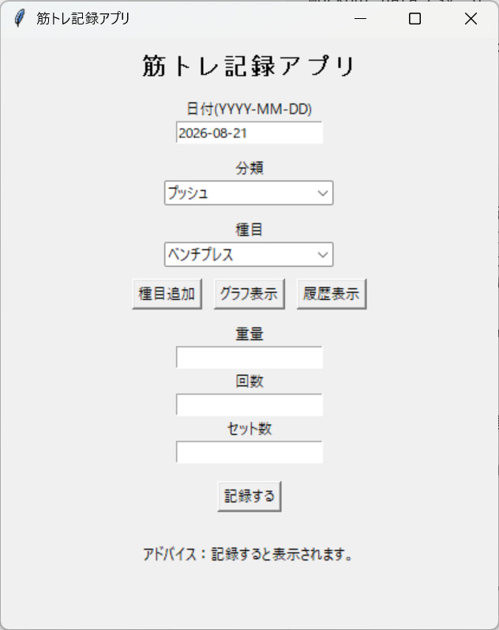
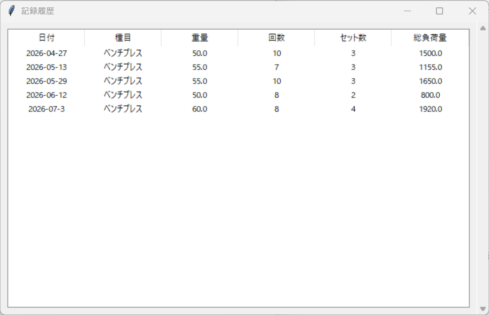
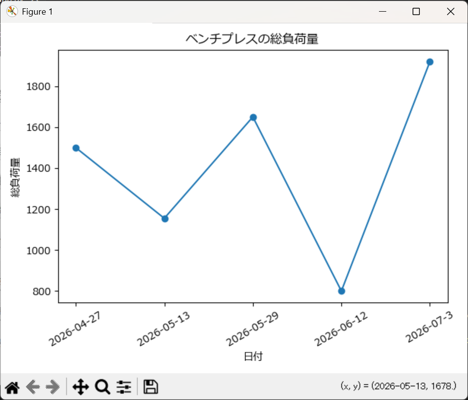

# MuscleNote 💪

**筋力トレーニングの記録・保存・可視化を行うPython製デスクトップアプリケーション**

トレーニング種目、重量、回数、セット数を記録し、
**重量 × 回数 × セット数**
から総負荷量を計算する。

保存したデータは履歴一覧やグラフから確認でき、過去のトレーニングとの変化を振り返ることができる。

---

## 📸 Screenshots

### メイン画面



### 記録履歴



### 総負荷量グラフ



---

## 🎯 制作背景

筋力トレーニングを継続する中で、単純に「何kgを持ち上げたか」だけでなく、

**トレーニング全体でどれくらいの負荷をかけたのかを記録し、過去と比較したい**

と考えたことから制作した。
また、Pythonの学習として個別の処理を書くことだけではなく、

**入力 → 計算 → 保存 → データ処理 → 可視化**

までを一つのアプリケーションとして実装することを目的とした。

---

## ✨ 主な機能

### 📝 トレーニング記録

以下の情報を入力してトレーニングを記録。

* 日付
* トレーニング分類
* 種目
* 重量
* 回数
* セット数

日付はアプリ起動時に当日の日付が自動入力される。

---

### 🏋️ 分類・種目選択

トレーニングを

* プッシュ
* プル
* スクワット

などの分類から選択可能

選択した分類に応じて種目候補を表示し、プルダウンから種目を選択。
必要に応じて新しい種目を追加可能。

---

### 📊 総負荷量の計算

入力されたデータから、トレーニングの総負荷量を計算

```text
総負荷量 = 重量 × 回数 × セット数
```

例：

```text
ベンチプレス
60kg × 8回 × 4セット

総負荷量 = 1,920kg
```
トレーニング全体のボリュームを数値として記録できる

---

### 💾 CSVへのデータ保存

記録したトレーニングデータはCSVファイルへ保存

保存項目：

* 日付
* 種目
* 重量
* 回数
* セット数
* 総負荷量

アプリを終了しても過去のデータを保持

---


### 📋 記録履歴の表示

保存したトレーニングデータをアプリ上で一覧表示

過去の

* 重量
* 回数
* セット数
* 総負荷量

を確認できるため、以前のトレーニング内容を簡単に振り返ることができる

---

### 📈 総負荷量の可視化

Pandasを利用してCSVデータを読み込み、Matplotlibを利用して総負荷量の推移をグラフ化

同じ種目の記録を時系列で表示することで、トレーニング量の変化を視覚的に確認できます。

---

### 💬 記録結果のフィードバック

保存した記録をもとに、過去のトレーニングとの変化を確認できる簡易フィードバックを表示します。

---

## 🛠 使用技術

| 技術            | 用途          |
| ------------- | ----------- |
| Python        | アプリケーション全体  |
| Tkinter / ttk | GUI         |
| Pandas        | データ読み込み・加工  |
| Matplotlib    | データ可視化      |
| CSV           | トレーニングデータ保存 |
| datetime      | 日付の自動入力・処理  |

---


## 🚀 実行方法

### 1. RepositoryをClone

```bash
git clone https://github.com/in-river/muscle-note.git
cd muscle-note
```

### 2. 仮想環境を作成

Windows：

```bash
python -m venv .venv
.venv\Scripts\activate
```

macOS / Linux：

```bash
python3 -m venv .venv
source .venv/bin/activate
```

### 3. 必要なライブラリをインストール

```bash
python -m pip install pandas matplotlib
```

### 4. アプリを起動

```bash
python workout_app.py
```

---


## 📁 ファイル構成

```text
muscle-note/
│
├── workout_app.py
├── workout_data.csv
│
├── images/
│      ├── main.png
│      ├── history.png
│      └── graph.png
│
└── README.md
```

---


## 🔧 今後の改善案

* UIデザインの改善
* 記録履歴の並び替え・絞り込み
* 種目ごとの詳細な統計表示
* 期間ごとのトレーニング量の比較
* データベースを利用した記録管理
* Web / モバイルアプリへの展開


